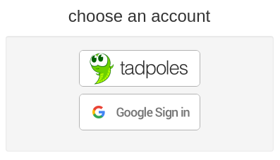
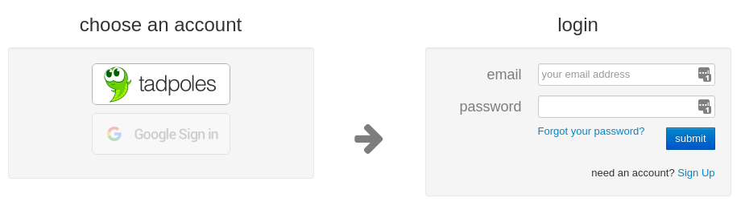
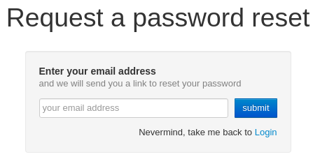

## Using Gmail Accounts

**If you are not comfortable understanding or changing online account information DO NOT PROCEED.
The author does not take responsibility for account changes made on any website due to following these instructions.**

**This tool is not associated with Gmail or Google in any way.
Do not use or alter your Google specific account information while using this tool.**

---

Follow these steps if you do not already have a _tadpoles.com_ specific password, that is a password specifically for the _tadpoles.com_ website!

When on the _tadpoles.com_ sign in page:

If you normally log in with the **Google Sign in** button you need to follow these steps to add a _tadpoles.com_ specific password to your tadpoles account.

1. Go to the [login](https://www.tadpoles.com/home_or_work) page, and choose **families**.

2. Click the **tadpoles** account button.

3. Click the **Forgot your password?** link.

Follow the steps to reset the account password.
After entering a gmail account to the reset password form you will see "Please visit your google account page to change your password" and the submit button is hidden. Using inspect element go to button class pull-right btn btn-primary and change "display none" to "display visible". You can now click submit and follow directions in email to reset password.
This allows you to set a password on an account using a gmail address that did not have a password set already. 
This is for your _tadpoles.com_ password only!
Do not make any changes to your gmail account.

Use this _tadpoles.com_ password for the `tadpoles-backup` tool when prompted.

See **[Usage](../README.md#usage)** section for additional details.
