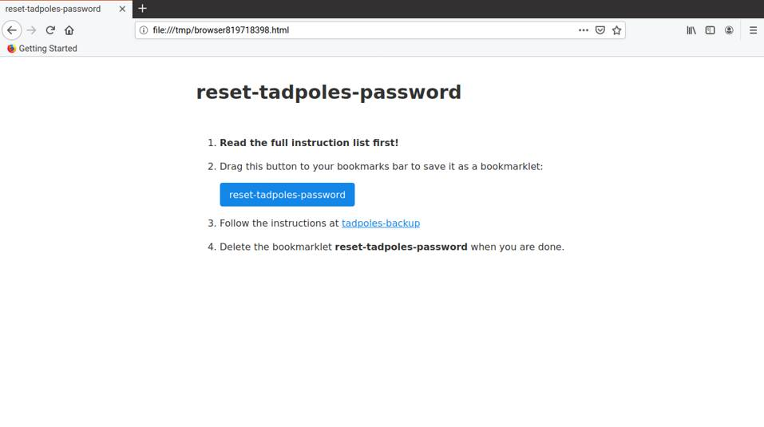
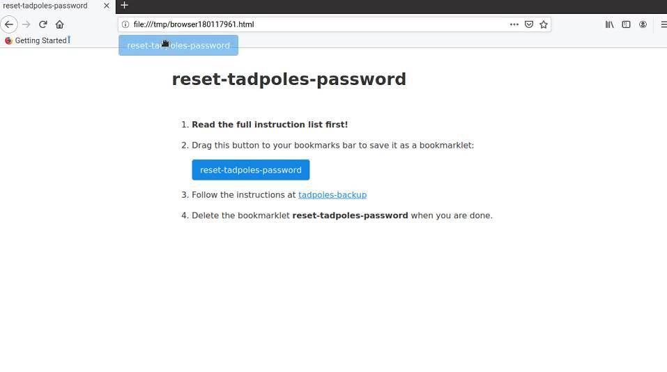
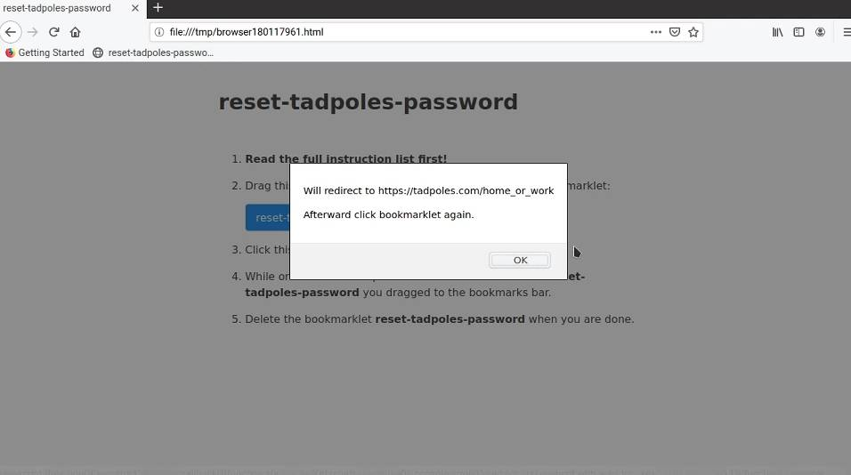
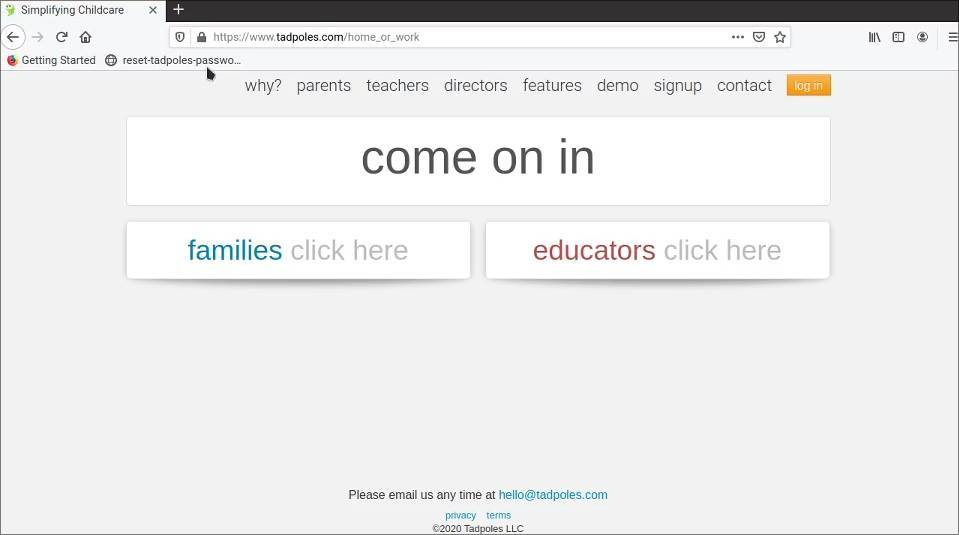
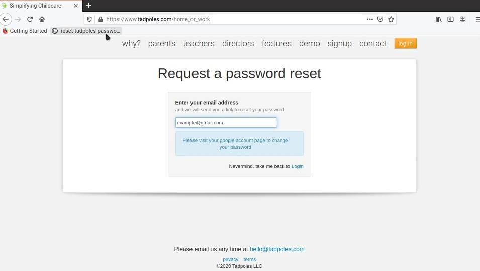
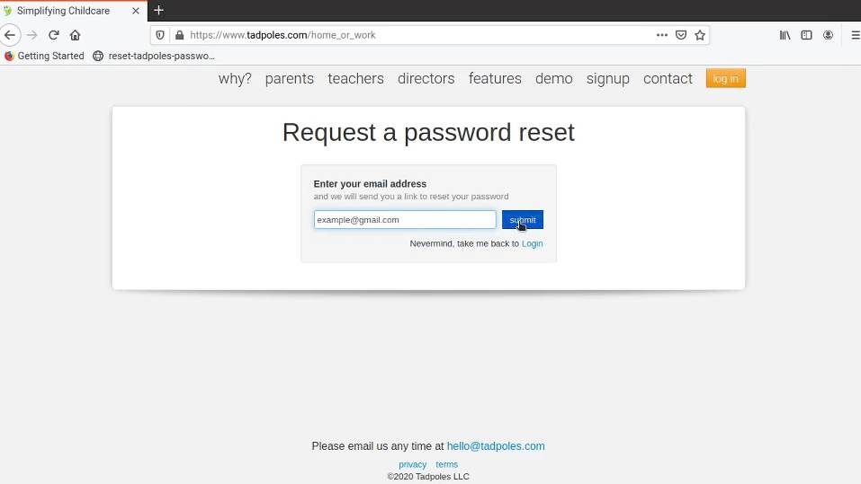

## Using Gmail Accounts

**If you are not comfortable understanding or changing online account information DO NOT PROCEED.
The author does not take responsibility for account changes made on any website due to following these instructions.**

**This tool is not associated with Gmail or Google in any way.
Do not use or alter your Google specific account information while using this tool.**

---

Follow these steps to reset or create a tadpoles.com specific password. If you would rather not use the helper utility you can follow the manual steps [here](./GoogleAccountSignInManual.md).

1. Execute the command line tool with the `reset-password` command

    `$ tadpoles-backup reset-password`

    `$ tadpoles-backup.exe reset-password`

2. It will ask you to press **ENTER** to open up your default web browser. This has been tested with the latest versions of Google Chrome and Mozilla Firefox, but is still considered an experimental feature.

3. You should see a page like this with instructions.

    

4. Drag the `reset-tadpoles-password` button to your bookmarks bar.

    

5. Click the `reset-tadpoles-password` bookmark from the bar. It will display a pop-up saying the page will be redirected to tadpoles.com, click OK.

    

6. You should now be on this page: `tadpoles.com/home_or_work`. Click the `reset-tadpoles-password` bookmark from the bar. It will automatically navigate you to the password reset form.

    

7. Enter your email, and if the submit button disappears click on the `reset-tadpoles-password` bookmark from the bar to show it again.

    

8. Click the submit button and check your email inbox for the reset link email.

    

9. Delete the bookmarklet `reset-tadpoles-password` from your bookmarks bar.

10. You can now use the password you create via the reset email to log into the `tadpoles-backup` cli tool.

   See **[Usage](../README.md#usage)** section for additional details.

